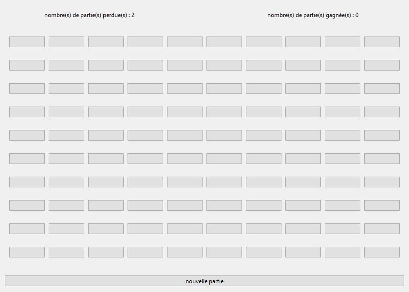
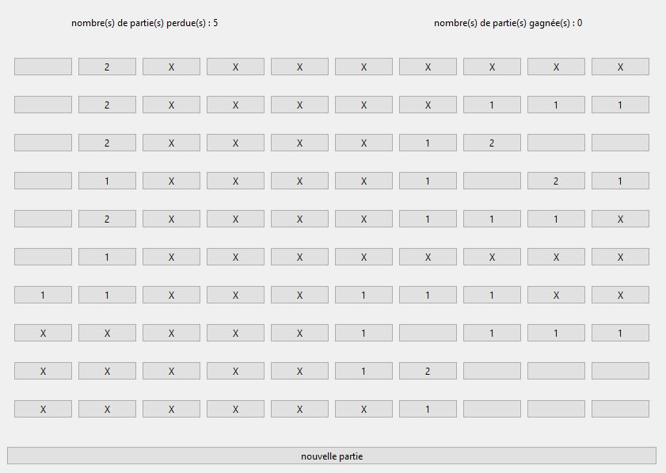

[](https://opensource.org/licenses/) [](https://www.python.org/downloads/)
# **Démineur MVC**

> Auteur : CZARKOWSKI Matthieu


## **Le projet 📢**

Le projet a pour but de réaliser le jeu démineur sous PyQt avec l'architecture MVC.

Le but du jeu est de découvrir toutes les cases libres sans faire exploser les mines, c'est-à-dire sans cliquer sur les cases qui les dissimulent. Lorsque le joueur clique sur une case libre comportant au moins une mine dans l'une de ses cases avoisinantes, un chiffre apparaît, indiquant ce nombre de mines.

## **Les prérequis 📍**

### Langage 📙

Ce projet tourne sous python, je vous conseille d'utilisé la version 3.10 Python.

Python : https://www.python.org/

### Librairies 📚

> #### 1. PyQt 

**_PyQt_** est une librarie qui permet de lier le langage Python avec la bibliothèque Qt.
Celle-ci permet de créer des interfaces en proposant différents outils.

```
pip install pyQt6
```

PyQt : https://doc.qt.io/qtforpython/ 


> #### 2. Numpy

La bibliotèque **_Numpy_** est une bibliothèque permettant de manipuler matrices ou tableaux multidimensionnels

```
pip install numpy
```

Numpy : https://numpy.org/

## **Comment utiliser l'application ❓**

Tout d'abord télécharger ou forker le projet au complet pour avoir l'ensemble des fichiers.

### Lancer le programme ▶️

> #### 1. Avec VSC 👨‍💻

Pour utiliser le programme à partir du code, il faut run (démarrer) le fichier **Controller.py** grâce à un éditeur de code comme VSC.

VS code : https://code.visualstudio.com

> #### 2. Avec la console 💻

Avec powershell ou le shell unix rendez-vous dans le dossier où se situent les fichiers ensuite exécuter cette commande :
```
python Controller.py
```


### Le Jeu 🎲

Il suffit de cliquer sur les boutons pour jouer à l'endroit séléctionner et dévoillé les cases.
Vous pouvez relancer la partie avec le bouton "nouvelle partie"



### Autres Screenshots de l'interface 📸



